# TAC Workflow Diagrams

Visual step-by-step breakdowns of all TAC workflows.

---

## Topic Discovery & Validation (Dr. Carla)


**Key Features:**
- **Language Detection:** Auto-detects from first user message (step 02)
- **Multiple Topics:** 3-5 interest areas → 5-8 angles
- **Passive Check:** Patricia subprocess for quick source counts (step 05b)
- **Collaborative Filtering:** Narrow to 2-3 finalists based on source availability + student preference
- **Deep Validation:** Full library validation for finalists only

---

## Source Validation (Patricia)

```mermaid
flowchart TD
    Start([Receive topic from Carla]) --> Init[Step 01: Init]
    Init --> CheckExisting{Existing session?}
    CheckExisting -->|Yes| Continue[Step 01b: Continue]
    CheckExisting -->|No| Handoff[Step 02: Handoff Confirmation<br/>Inherit language, confirm parameters]
    Continue --> ResumeStep[Resume from last step]

    Handoff --> ParallelSearch[Step 03: Parallel Search<br/>5 databases simultaneously]
    ParallelSearch --> ScoreRank[Step 04: Score and Rank<br/>Dual scoring: Relevancy % + Quality %]

    ScoreRank --> Threshold[Step 05: Threshold Analysis<br/>Check if ≥8 sources]

    Threshold --> CheckThreshold{Sources ≥ 8?}
    CheckThreshold -->|Yes| ShowTop10[Display top 10 sources]
    CheckThreshold -->|No| Brainstorm[Brainstorming:<br/>Scope adjustment strategies]

    Brainstorm --> OfferCarla{Standalone mode?}
    OfferCarla -->|Yes| OfferCarlaOption[Offer return to Carla]
    OfferCarla -->|No| Refinement
    ShowTop10 --> Refinement
    OfferCarlaOption --> Refinement

    Refinement[Step 06: Refinement Loop]
    Refinement --> RefineChoice{Student choice}
    RefineChoice -->|Refine search| BackToSearch[Loop to Step 03]
    RefineChoice -->|Add custom source| AddCustom[Score custom source]
    RefineChoice -->|Satisfied| Selection[Step 07: Source Selection]
    RefineChoice -->|Consult Carla| LaunchCarla[Launch Dr. Carla workflow]

    BackToSearch --> ParallelSearch
    AddCustom --> Refinement
    LaunchCarla -.->|Return with new scope| ParallelSearch

    Selection --> Finalize[Step 08: Finalize and Handoff]
    Finalize --> ExportChoice{Export choice}
    ExportChoice -->|Literature Review| HandoffLitReview[Handoff to Literature Review]
    ExportChoice -->|Done| End([Workflow Complete])
```



**Key Features:**
- **Language Inheritance:** Inherits from Topic Discovery handoff
- **Parallel Search:** 5 databases simultaneously (JSTOR, SciELO, CAPES, Web of Science, Google Scholar)
- **Dual Scoring:** Relevancy % (0-100) + Quality % (0-100), ranked by relevancy
- **Top 10 Display:** Shows top 10 when ≥10 sources found
- **Threshold Analysis:** ≥8 sources required, Brainstorming if <8
- **Refinement Loop:** Can loop back to search, add custom sources, or consult Carla
- **Carla Integration:** Standalone mode can invoke Carla for topic scope changes

---

## Workflow Integration Flow


**Integration Points:**
- **Carla → Patricia (Source Validation):** Handoff includes topic, research question, student context
- **Patricia (Source Validation) → Patricia (Lit Review):** Handoff includes selected sources (10-15)
- **Loop-back capability:** Both Patricia workflows can return to Carla if topic scope changes

---

## Data Flow Diagram


**Key Data Flows:**
- **Topic Discovery output:** Validated topic + research question → handoff file
- **Source Validation output:** 10-15 selected sources → handoff file
- **Patricia Memory:** Stores ALL sources found (not just selected) for later use
- **Literature Review input:** Receives selected sources + can access all found sources from memory

---

## Passive Source Check Detail (Step 05b)


**Critical Design:**
- **Patricia runs as subprocess** (not Carla doing searches herself)
- **Quick counts only** (no deep validation - that's step 06)
- **Carla interprets results** and can redirect if all angles fail
- **Proper separation:** Patricia = search expert, Carla = topic advisor

---

## Language Detection Flow


**Language Persistence:**
- **Auto-detection:** Happens in Topic Discovery step 02 from user's first input
- **Config storage:** Saved in `tac/config.yaml` as `preferred_tac_language`
- **Handoff inheritance:** Source Validation reads language from Topic Discovery handoff
- **User override:** Students can switch language mid-conversation, updates persist

---

## Threshold Analysis & Brainstorming (Step 05)

```mermaid
flowchart TD
    Start[Sources scored and ranked] --> CountSources[Count total sources found]

    CountSources --> CheckThreshold{Total ≥ 8?}

    CheckThreshold -->|Yes| MetThreshold[✅ Threshold Met]
    CheckThreshold -->|No| WarningThreshold[⚠️ Threshold Warning]

    MetThreshold --> ShowTop{Total ≥ 10?}
    ShowTop -->|Yes| DisplayTop10[Display top 10 sources]
    ShowTop -->|No| DisplayTop5[Display top 5 sources]

    DisplayTop10 --> Breakdown[Show Database Breakdown<br/>+ Quality Distribution]
    DisplayTop5 --> Breakdown

    WarningThreshold --> LaunchBrainstorm[Launch Brainstorming:<br/>Scope adjustment strategies]
    LaunchBrainstorm --> Generate[Generate 3-5 strategies:<br/>- Broader scope<br/>- Narrower focus<br/>- Alternative keywords<br/>- Temporal adjustment<br/>- Language expansion]

    Generate --> PresentStrategies[Present strategies<br/>to student]
    PresentStrategies --> CheckMode{Workflow mode?}

    CheckMode -->|Standalone| OfferCarla[Offer [C]arla option]
    CheckMode -->|Handoff| ProceedRefinement[Proceed to refinement loop]

    OfferCarla --> ProceedRefinement
    Breakdown --> ProceedRefinement

    ProceedRefinement --> RefinementLoop[Step 06: Refinement Loop]

    style LaunchBrainstorm fill:#ffe1f5
    style Generate fill:#ffe1f5
```

**Brainstorming Integration:**
- **Triggered when:** <8 sources found
- **Purpose:** Generate scope adjustment strategies BEFORE warning student
- **Output:** 3-5 actionable strategies with rationale
- **Carla option:** Only offered in standalone mode when <8 sources

---

## Literature Review Builder (Patricia)

```mermaid
flowchart TD
    Start([Receive sources from Source Validation]) --> Init[Step 01: Init]
    Init --> CheckExisting{Existing session?}
    CheckExisting -->|Yes| Continue[Step 01b: Continue]
    CheckExisting -->|No| HandoffLoad[Step 02: Handoff Load<br/>Load 10-15 selected sources]
    Continue --> ResumeStep[Resume from last step]

    HandoffLoad --> ExportChoice[Step 03: Export Choice]
    ExportChoice --> ExportDecision{Export format}
    ExportDecision -->|S - Selected Only| ExportSelected[Generate source-list.md/docx<br/>10-15 selected sources]
    ExportDecision -->|A - All Sources| ExportAll[Generate source-list.md/docx<br/>All found + selected at top]

    ExportSelected --> LitReviewDecision[Step 04: Lit Review Decision]
    ExportAll --> LitReviewDecision

    LitReviewDecision --> ContinueLitReview{Continue to<br/>lit review?}
    ContinueLitReview -->|N - No| SkipToCompletion[Skip to Step 10:<br/>Completion]
    ContinueLitReview -->|Y - Yes| ThematicOrg[Step 05: Thematic Organization<br/>Collaborative theme discovery]

    ThematicOrg -->|Brainstorming integration| Synthesis[Step 06: Lit Review Synthesis<br/>Generate lightweight draft]
    Synthesis -->|Sub-agents: Parallel theme synthesis<br/>Advanced Elicitation: Quality gates| ReviewSat[Step 07: Review Satisfaction]

    ReviewSat --> SatisfactionCheck{Student decision}
    SatisfactionCheck -->|S - Satisfied| SidecarUpdate[Step 08: Sidecar Update]
    SatisfactionCheck -->|V - Return to Source Validation| BackToSourceVal[Exit to Source Validation<br/>Need different sources]
    SatisfactionCheck -->|C - Invoke Carla| InvokeCarla[Exit to Carla<br/>Topic scope changed]
    SatisfactionCheck -->|R - Regenerate| RegenerateThemes[Loop back to Step 05<br/>Try different themes]

    RegenerateThemes --> ThematicOrg

    SidecarUpdate --> Polish[Step 09: Polish<br/>Optimize lit review flow]
    Polish --> Completion[Step 10: Completion]
    SkipToCompletion --> Completion

    Completion --> Outputs[Outputs Generated:<br/>✅ source-list.md/docx<br/>✅ literature-review.md/docx]
```



**Key Features:**
- **Dual Format Output:** Both MD (for state tracking) + DOCX (for students) via Pandoc
- **ABNT Citations:** Default citation format for Brazilian students
- **Two Paths:**
  - MANDATORY: Source list export (selected only OR all sources)
  - OPTIONAL: Full literature review synthesis
- **Collaborative Facilitation:** Patricia works WITH student to discover themes
- **Loop-back Capability:** Can return to Source Validation or invoke Carla
- **Sub-agents:** Parallel synthesis of thematic sections in Step 06
- **Tools Integration:**
  - Brainstorming (Step 05 - theme generation)
  - Advanced Elicitation (Step 06 - quality gates)

---

## Complete TAC Flow (All Three Workflows)


**Complete Integration:**
- **Carla (Topic Discovery)** → Validated topic + research question
- **Patricia (Source Validation)** → 10-15 selected sources with dual scoring
- **Patricia (Literature Review Builder)** → Source list + Thematic lit review framework
- **João (Writing Guide)** → _(Coming soon)_ Writing support and thesis structure

**Loop-back Points:**
1. Source Validation → Topic Discovery (if topic scope needs change)
2. Literature Review → Source Validation (if need different sources)
3. Literature Review → Topic Discovery (if topic scope changed during review)

---

## Literature Review Builder - Detailed Step Flow


**Step Count:** 11 steps (Create mode)
**Estimated Duration:** Multi-session (continuable)
**Tools Required:** Pandoc (for MD → DOCX conversion)

**Output Files:**
1. **source-list-{date}.md + .docx** (MANDATORY)
   - Selected sources only OR all sources with selected at top
   - ABNT citation format
   - Title, Author, Year, Journal, Abstract, Access Link

2. **literature-review-{date}.md + .docx** (OPTIONAL)
   - Overview, Thematic Groups, Theme Synthesis
   - Patterns & Gaps, Framework Outline
   - Lightweight reference document for student

---

_Last updated: 2026-01-26_
