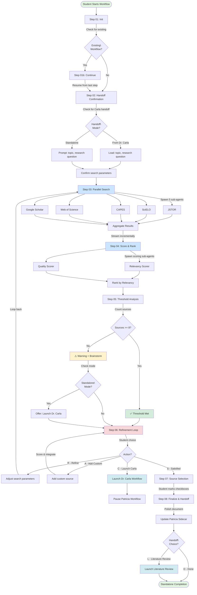

# Source Validation Workflow

**Agent:** Patricia (Research Librarian)
**Purpose:** Deep database validation of thesis topics with parallel search, dual scoring, and iterative refinement
**Status:** 🔄 In Progress (Design Complete)

---

## Overview

The Source Validation workflow is Patricia's core validation process. It receives a validated topic from Dr. Carla (or directly from the student in standalone mode), searches 5 academic databases in parallel, returns 10-15 ranked sources with dual scoring, and enables iterative refinement until the student has a solid foundation for literature review.

### Key Features

- **Parallel Database Search:** Searches JSTOR, SciELO, CAPES Periódicos, Web of Science, and Google Scholar simultaneously
- **Dual Scoring System:** Relevancy % (topic match) + Quality % (peer review, journal tier, citations)
- **Threshold Protection:** Minimum 8 sources required - warns if insufficient
- **Iterative Refinement:** Request "more sources," "narrower focus," or "broader scope" anytime
- **Custom Source Integration:** Add your own sources (link, text, or PDF) with automatic scoring
- **Multi-Session Support:** Pause and resume over weeks/months
- **Integration Ready:** Receives handoff from Dr. Carla, passes to Literature Review

---

## Workflow Diagram



---

## Workflow Steps

### Step 01: Initialization (Continuable)

**Goal:** Check for existing workflow session, initialize new workflow if none exists

**Logic:**
- Check for existing output document in `{output_folder}`
- IF exists AND has `stepsCompleted` → Route to **Step 01b: Continue**
- IF not exists → Create new workflow → Route to **Step 02: Handoff Confirmation**

**Output:** Initialized workflow with frontmatter tracking

---

### Step 01b: Continuation Handler

**Goal:** Resume prior session from where student left off

**Logic:**
- Load output document frontmatter
- Read `stepsCompleted` array to determine last completed step
- Read last step file to find `nextStepFile`
- Welcome user back with summary: "You were last working on [topic], found [X] sources, last session [date]"
- Route to appropriate step

**Output:** User resumed at correct workflow position

---

### Step 02: Handoff Confirmation

**Goal:** Receive validated topic from Dr. Carla OR prompt for standalone topic, confirm search parameters

**Input Discovery:**
1. Check for Dr. Carla handoff file: `{output_folder}/carla-handoff-*.md`
2. Check Patricia sidecar: `{patricia_sidecar}/pending-requests.md`
3. If found → **Handoff Mode** (load topic, research question)
4. If not found → **Standalone Mode** (prompt user for topic, research question)

**Interaction:**
- Confirm/adjust search parameters: date range, language preferences, excluded keywords
- Check Patricia sidecar for saved database credentials
- User reviews parameters

**Menu:** A/P/C (Advanced Elicitation for topic clarification, Party Mode for refinement)

**Output:**
- `workflowMode` set to 'handoff' or 'standalone'
- Search Parameters section written to output document
- Frontmatter updated: `topic`, `researchQuestion`, `searchParameters`

---

### Step 03: Parallel Database Search

**Goal:** Execute searches across 5 databases simultaneously using sub-agents

**Subprocess Optimization:** Pattern 4 (Parallel Execution)

**Execution:**
1. Spawn 5 search sub-agents:
   - JSTOR (if institutional access)
   - SciELO (public access)
   - CAPES Periódicos (if institutional access)
   - Web of Science (if institutional access)
   - Google Scholar (public access)
2. Each sub-agent returns: source list with metadata
3. Aggregate results as each sub-agent completes
4. Stream results incrementally to output document
5. Monitor token consumption (warn at 5% threshold)

**Menu:** C-only (proceed when ready to see results)

**Output:**
- Search Results section (incremental updates)
- Frontmatter updated: `totalSourcesFound`, `databasesSearched`

**Error Handling:**
- Database timeout: Continue with available results, log failures
- Token warning: Pause execution, save state, allow continuation

---

### Step 04: Score & Rank

**Goal:** Apply dual scoring (relevancy % + quality %), rank sources by relevancy

**Subprocess Optimization:** Patterns 2, 3, 4
- Pattern 3: Load quality scoring rubric from `data/quality-scoring-rubric.md`
- Pattern 2 + 4: Analyze sources in parallel via sub-agents

**Execution:**
1. Load quality assessment rubric via subprocess
2. Spawn scoring sub-agents:
   - **Relevancy Scorer:** Calculate 0-100% topic match
   - **Quality Scorer:** Calculate 0-100% based on peer review, journal tier, citations
3. Use Advanced Elicitation to critically evaluate quality metrics from multiple perspectives
4. Rank sources by relevancy (highest to lowest)
5. Generate summaries in original language
6. Validate access links

**Menu:** A/P/C (Advanced Elicitation critical for quality validation)

**Output:**
- Search Results section updated with scores and rankings
- Sources displayed with:
  - Title, Author(s), Year, Journal
  - Relevancy % | Quality %
  - Summary (original language)
  - Access link
  - Checkbox [ ]

---

### Step 05: Threshold Analysis

**Goal:** Check if ≥8 sources found, present results, use Brainstorming if needed

**Execution:**
1. Count total sources found
2. **IF ≥8 sources:** Threshold met ✅ → Proceed normally
3. **IF <8 sources:**
   - Trigger warning ⚠️
   - Use Brainstorming to generate scope adjustment strategies
   - Present warning with recommendations
   - **IF Standalone Mode:** Add option to launch Dr. Carla workflow
4. Present Database Breakdown (optional section)
5. Present Quality Distribution (optional section)

**Menu:** A/P/C (Brainstorming for scope adjustments, Advanced Elicitation for warning assessment)

**Output:**
- Threshold Analysis section
- Database Breakdown section (optional)
- Quality Distribution section (optional)
- Frontmatter updated: `thresholdStatus` ('met' or 'warning')

---

### Step 06: Refinement Loop

**Goal:** Handle iterative refinement, detect topic changes, support custom sources

**Critical Decision Point - Custom Menu:**

```
[R]efine - Adjust search parameters, loop back to Step 03
[A]dd custom - Add user-provided sources with scoring
[S]atisfied - Proceed to source selection (Step 07)
[C]arla - Launch Dr. Carla workflow (if standalone + <8 sources)
```

**Refinement Path [R]:**
1. Use Advanced Elicitation to deeply understand refinement needs
2. Use Brainstorming to generate alternative search strategies
3. Sub-menu: [M]ore sources / [N]arrower focus / [B]roader scope
4. Adjust search parameters based on choice
5. Update frontmatter: `refinementCount++`
6. **LOOP BACK to Step 03** with new parameters
7. Log refinement in Refinement History section
8. Detect topic changes → offer return to Dr. Carla

**Custom Source Path [A]:**
1. Sub-menu: How to provide source?
   - [L]ink - Public URL
   - [T]ext - Paste content
   - [P]DF - Upload/path to PDF
2. Collect source details
3. Score custom source (same dual scoring as database sources)
4. Generate summary
5. Add to document (maintain ranking by relevancy)
6. Mark as "[User-Provided]" for transparency
7. Update `totalSourcesFound` count
8. Update Threshold Analysis if this pushes ≥8
9. **Return to Step 06 menu** (can add more)

**Dr. Carla Path [C]:** (Standalone Mode only)
1. Launch Dr. Carla's Topic Discovery workflow
2. Pass: current topic, search results summary, refinement context
3. Patricia workflow pauses (can resume later with new topic)

**Menu:** Custom [R/A/S/C] + A/P options

**Output:**
- Refinement History section updated with each iteration
- Frontmatter updated: `refinementCount`, `customSourcesAdded`

---

### Step 07: Source Selection

**Goal:** Student selects sources via checkboxes for literature review

**Execution:**
1. Student marks checkboxes in document: `[ ]` → `[x]`
2. Confirm selection count
3. Validate: At least 1 source must be selected

**Menu:** C-only (simple, efficient)

**Output:**
- Selected Sources section
- Frontmatter updated: `selectedSources` array with selected source IDs

---

### Step 08: Finalize & Handoff

**Goal:** Finalize document, update sidecar memory, offer Literature Review handoff

**Execution:**
1. Polish output document (formatting, section completeness)
2. Update Patricia sidecar (`memories.md`) with:
   - Search history
   - Successful strategies used
   - Student preferences learned
3. Offer handoff decision

**Custom Menu:**
```
[L]iterature Review - Launch Literature Review workflow with selected sources
[D]one - Standalone completion (no handoff)
```

**Literature Review Handoff [L]:**
1. Create handoff file: `{output_folder}/source-validation-complete-{topic-slug}.md`
2. Include: `selectedSources` array with full details
3. Launch: `{project-root}/_bmad/tac/workflows/literature-review/workflow.md`
4. Pass handoff file path

**Output:**
- Finalized output document
- Next Steps section
- Patricia sidecar updated
- Workflow marked complete in frontmatter
- Handoff file created (if Literature Review selected)

---

## Integration Points

### Upstream Integration

**FROM: Dr. Carla's Topic Discovery Workflow**

**Handoff Data:**
- Validated topic (refined and confirmed with student)
- Research question
- Student context (optional: student ID, program, advisor)

**Handoff Methods:**
1. Handoff file: `{output_folder}/carla-handoff-{studentId}.md`
2. Pending requests: `{patricia_sidecar}/pending-requests.md`

**Trigger:** Dr. Carla Step 06 completes topic validation

---

### Downstream Integration

**TO: Dr. Carla's Topic Discovery Workflow** (Loop-back)

**Handoff Data:**
- Current topic
- Search results summary
- Refinement context (why sources insufficient)

**Trigger:** Step 06 [C]arla selected (standalone mode, <8 sources)

**TO: Patricia's Literature Review Workflow**

**Handoff Data:**
- Selected sources (full details: titles, authors, links, scores, summaries)
- Topic and research question
- Search parameters used

**Handoff File:** `{output_folder}/source-validation-complete-{topic-slug}.md`

**Trigger:** Step 08 [L]iterature Review selected

---

## Output Document Structure

### Frontmatter

```yaml
---
stepsCompleted: ['step-01-init', 'step-02-handoff-confirmation', 'step-03-parallel-search', ...]
lastStep: 'step-06-refinement-loop'
lastContinued: '2026-01-25'
workflowMode: 'handoff' # or 'standalone'
workflowStatus: 'in-progress' # or 'complete'
topic: '[Validated topic from Dr. Carla or user]'
researchQuestion: '[Student research question]'
totalSourcesFound: 12
customSourcesAdded: 2
selectedSources: ['source-1', 'source-3', 'source-7']
refinementCount: 1
thresholdStatus: 'met' # or 'warning'
databasesSearched: ['JSTOR', 'SciELO', 'CAPES', 'WebOfScience', 'GoogleScholar']
searchParameters:
  dateRange: '2015-2025'
  languages: ['en', 'pt']
  excludedKeywords: ['keyword1', 'keyword2']
---
```

### Document Sections (Semi-Structured)

**Required Sections:**

1. **Search Parameters**
   - Topic statement
   - Research question
   - Databases searched
   - Search terms used
   - Filters applied (date range, language, etc.)
   - Timestamp

2. **Search Results**
   - Source list (ranked by relevancy)
   - Per source:
     - Title
     - Author(s)
     - Publication year
     - Journal/Source
     - **Relevancy %** (0-100%)
     - **Quality %** (0-100%)
     - Summary (original language)
     - Access link
     - Checkbox [ ]
     - Tag: [User-Provided] (if custom)

3. **Threshold Analysis**
   - Total sources found: X
   - Threshold status: ✅ Met (≥8) OR ⚠️ Warning (<8)
   - If warning: Recommendations

4. **Selected Sources**
   - Checkboxes marked by student
   - Count of selected sources
   - Ready for Literature Review

5. **Refinement History**
   - Log of refinement iterations
   - Per iteration:
     - Date
     - Refinement request
     - New search parameters
     - Results count

**Optional Sections:**

6. **Database Breakdown**
   - Sources found per database
   - JSTOR: X sources
   - SciELO: X sources
   - CAPES Periódicos: X sources
   - Web of Science: X sources
   - Google Scholar: X sources

7. **Quality Distribution**
   - High quality (80-100%): X sources
   - Medium quality (60-79%): X sources
   - Lower quality (40-59%): X sources
   - Note: Sources <40% not returned

8. **Next Steps**
   - Recommendation: Launch Literature Review workflow
   - OR: Return to Dr. Carla for topic adjustment
   - OR: Continue refining

---

## Success Criteria

**Minimum Success:**
- Student has selected sources (≥1) OR acknowledged threshold warning
- Minimum threshold addressed (≥8 sources OR <8 with refinement attempted/warning acknowledged)
- All sources have dual scoring (relevancy % + quality %)
- Student satisfied OR elected to return to Dr. Carla

**Quality Success:**
- All available databases searched
- Sources ranked accurately by relevancy
- Summaries in original language provided
- Access links valid and clickable
- Student made informed selection based on scores

**Integration Success:**
- Clean handoff from Dr. Carla (topic + research question received)
- Context flows back to Dr. Carla if refinements suggest topic change
- Clean handoff to Literature Review (selected sources passed)

---

## Tools & Technologies

**Core BMAD Tools:**
- ✅ Advanced Elicitation (Phase 3 scoring, Phase 5 refinement)
- ✅ Brainstorming (Phase 4 threshold, Phase 5 strategies)

**LLM Features:**
- ✅ Web-Browsing (database access, quality validation)
- ✅ File I/O (document building, sidecar access)
- ✅ Sub-Agents (parallel searches, scoring delegation)

**Memory Systems:**
- ✅ Output Document Frontmatter (stepsCompleted, state tracking)
- ✅ Patricia Sidecar (memories.md for long-term history)
- ✅ step-01b-continue.md (resumption logic)

**Future Integrations:**
- 📋 Academic Database Connector (MCP server for institutional API access)

---

## Development Roadmap

- [x] Workflow design complete
- [x] Step sequence finalized
- [x] Integration points defined
- [ ] Step files implementation
  - [ ] Step 01: Init
  - [ ] Step 01b: Continue
  - [ ] Step 02: Handoff Confirmation
  - [ ] Step 03: Parallel Search
  - [ ] Step 04: Score & Rank
  - [ ] Step 05: Threshold Analysis
  - [ ] Step 06: Refinement Loop
  - [ ] Step 07: Source Selection
  - [ ] Step 08: Finalize & Handoff
- [ ] Data files creation
  - [ ] database-search-strategies.md
  - [ ] quality-scoring-rubric.md
  - [ ] refinement-examples.md
- [ ] Template creation
  - [ ] source-validation-output.md
- [ ] Testing
  - [ ] Handoff mode testing
  - [ ] Standalone mode testing
  - [ ] Continuation testing
  - [ ] Custom source testing
  - [ ] Integration testing (Dr. Carla → Patricia → Literature Review)

---

## Related Documentation

- [Patricia Agent Guide](../agents/patricia.md)
- [Dr. Carla Agent Guide](../agents/dr-carla.md)
- [TAC Module Architecture](../architecture/overview.md)
- [Workflow Integration Patterns](../architecture/workflow-chaining.md)

---

*Last Updated: 2026-01-25*
